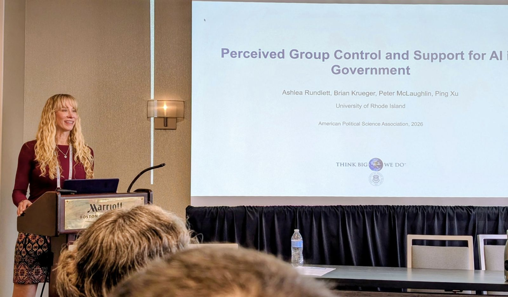
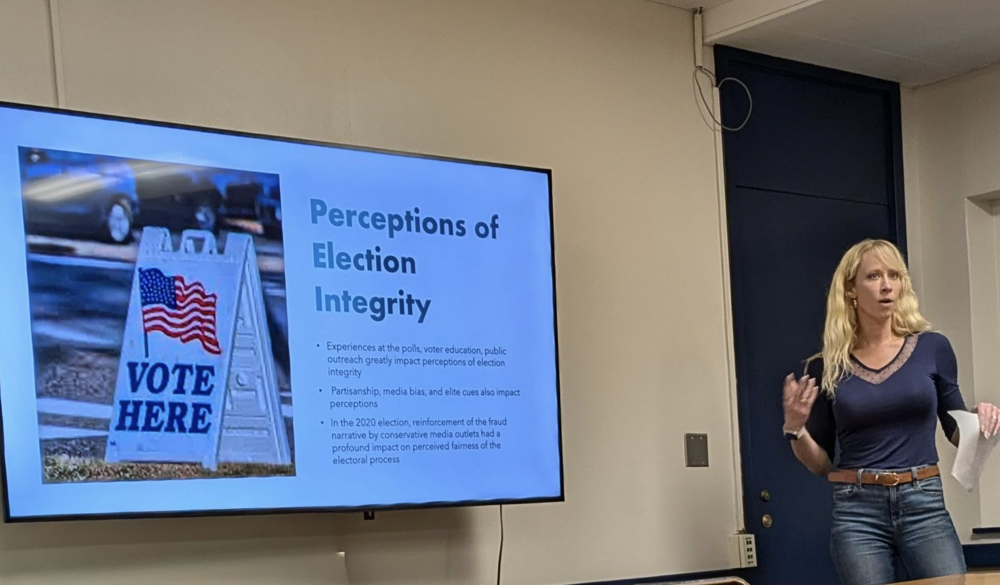

I study how citizens respond to political power and to changes in the institutions that hold it. My current projects examine public opinion on AI and other emerging technologies as the United States and China compete for influence, in Latin America and in the United States.

## Publications

### Book

Mark, Skip, Ashlea Rundlett, Mikhail Filippov, and David L. Cingranelli. 2026. [*Science and the Study of Human Rights*](https://books.google.com/books/about/Science_and_the_Study_of_Human_Rights.html?id=ZmTEEQAAQBAJ). State University of New York Press.

### Peer-reviewed articles

Wong, Cara, Jake Bowers, Daniel Rubenson, Mark Fredrickson, and Ashlea Rundlett. 2025. "[A Two-Path Theory of Context Effects: Pseudoenvironments and Social Cohesion](https://doi.org/10.1017/S0007123425101099)." *British Journal of Political Science* 55: e178.

Xu, Ping, Nina Küssau, Ashlea Rundlett, Skip Mark, Caroline Fowler, and Brian Krueger. 2025. "[Political Elites and Attitudes Toward International Organizations in the Trump Era](https://doi.org/10.1111/ssqu.70012)." *Social Science Quarterly* 106(3): e70012.

Rundlett, Ashlea. 2024. "[Auditing Democracy: How Corruption Revelations Shape Electoral Turnout in Brazilian Municipalities](https://jrap.scholasticahq.com/article/120744-auditing-democracy-how-corruption-revelations-shape-electoral-turnout-in-brazilian-municipalities)." *The Journal of Regional Analysis and Policy* 54(1): 16–34.

Hutchison, Marc, Kristin Johnson, and Ashlea Rundlett. 2023. "[Economic Inclusion and Social Trust in Africa: The Positive Effects of Political Reach](https://doi.org/10.1111/ssqu.13272)." *Social Science Quarterly* 104(4): 776–792.

Brennan, Bernard, Kristin Johnson, and Ashlea Rundlett. 2022. "[Human Rights During Transition: Accountability Mechanisms in Mexican States 1997–2008](https://doi.org/10.1177/1866802X221127711)." *Journal of Politics in Latin America* 14(3): 264–288.

Xu, Ping, Kristin Johnson, and Ashlea Rundlett. 2022. "[E-participation in Contemporary China: A Comparison with Conventional Offline Participation](https://doi.org/10.1177/15396754221107115)." *Chinese Public Administration Review* 13(3): 150–161.

Rundlett, Ashlea, and Kristin Johnson. 2020. "[Wars for Ethnic or Nationalist Supremacy](https://academic.oup.com/edited-volume/61835/chapter-abstract/546994283)." *Oxford Research Encyclopedia of International Studies*.

Wong, Cara, Jake Bowers, Daniel Rubenson, Mark Fredrickson, and Ashlea Rundlett. 2020. "[Maps in People's Heads: Assessing a New Measure of Context](https://doi.org/10.1017/psrm.2018.51)." *Political Science Research and Methods* 8(1): 160–168.

Vasquez, John A., and Ashlea Rundlett. 2016. "[Alliances as a Necessary Condition for Multiparty Wars](https://doi.org/10.1177/0022002715569770)." *Journal of Conflict Resolution* 60(8): 1395–1418.

Rundlett, Ashlea, and Milan Svolik. 2016. "[Deliver the Vote! Micromotives and Macrobehavior in Electoral Fraud](https://www.cambridge.org/core/journals/american-political-science-review/article/abs/deliver-the-vote-micromotives-and-macrobehavior-in-electoral-fraud/348D3A1DB751D4D4C91ABCDE2056F15E)." *American Political Science Review* 110(1): 180–197. Co-winner of the 2017 Best Article Award of the Comparative Democratization section of the American Political Science Association.

Winters, Matthew S., and Ashlea Rundlett. 2015. "[The Challenges of Untangling the Relationship Between Participation and Happiness](https://doi.org/10.1007/s11266-014-9500-z)." *Voluntas: International Journal of Voluntary and Nonprofit Organizations* 26(1): 5–23.

### Revise and resubmit

Mark, Skip, Ashlea Rundlett, Andrew Foote, and Stephen Bagwell. "Get Up Stand Up: IMF Compliance, Remittances, and Individual Protest Behavior." Revise and resubmit, *Journal of Conflict Resolution*.

### Working papers

Rundlett, Ashlea, Brian Krueger, Peter McLaughlin, and Ping Xu. "Perceived Group Control and Support for AI in Government."

McLaughlin, Peter, Ping Xu, Ashlea Rundlett, and Brian Krueger. "Perceived Party Coalitions, Attitudes Toward Hispanic Americans, and Immigration Policy Preferences."

Rundlett, Ashlea, Emily Lynch, and Ying Xiong. "Affective Polarization, Local Trust, and Perceptions of Electoral Fairness: Insights from Rhode Island."

Rundlett, Ashlea. "Rethinking the Effects of Exposed Corruption on Electoral Outcomes in Brazil."

Hutchison, Marc, Kristin Johnson, and Ashlea Rundlett. "Not in My Frontyard: The Effects of Neighboring Conflict on Democratic Behavior and Attitudes in Africa."

### Research in progress

"Does Great Power Competition Transform Public Attitudes Toward Strategic Technologies?" With Brian Krueger and Christina Chakar. Survey experiments examining how U.S.–China competition shapes support for AI and quantum-computing development.

"Material Power, Status Recognition, and Support for International Order." With Brian Krueger, Marc Hutchison, Ping Xu, and Qin Huang. Survey experiments examining how material power and symbolic recognition shape public support for international order in the United States and China.

"U.S.–China Competition over AI Infrastructure in Brazil and Mexico." Examines public preferences over AI infrastructure partnerships and the terms that supplier and recipient publics will accept.

### Policy reports and other publications

Rundlett, Ashlea, Ying Xiong, and Julie C. Keller. 2025. [*The Rhode Island Survey Initiative: 2025 Survey Report*](files/RI_Survey_Initiative_2025_Report.pdf). University of Rhode Island.

Rundlett, Ashlea, Roya Izadi, Meg Frost, and Skip Mark. 2024. *Global Rights Project (GRIP): 2024 Report*. Center for Nonviolence and Peace Studies, University of Rhode Island.

Mark, Skip, Ashlea Rundlett, and Rebecca Lister. 2023. ["Nicaragua on the Brink: Protests, Elections, and Mass Atrocity."](https://gjia.georgetown.edu/2023/03/17/nicaragua-on-the-brink-protests-elections-and-mass-atrocity/) *Georgetown Journal of International Affairs*, Online Edition.

::: {layout-ncol=2}
{fig-alt="Ashlea Rundlett presenting at a podium at the 2026 American Political Science Association meeting in Boston, with a projected slide titled Perceived Group Control and Support for AI in Government."}

{fig-alt="Ashlea Rundlett speaking next to a wall-mounted screen showing a slide titled Perceptions of Election Integrity."}
:::
