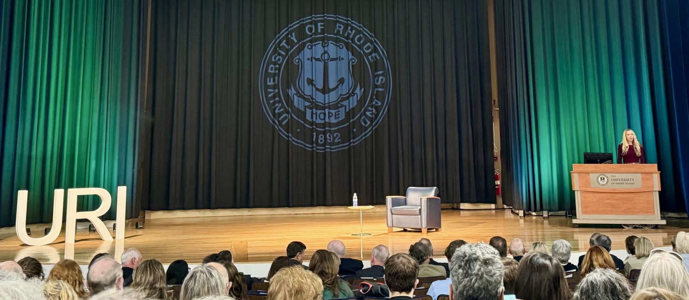
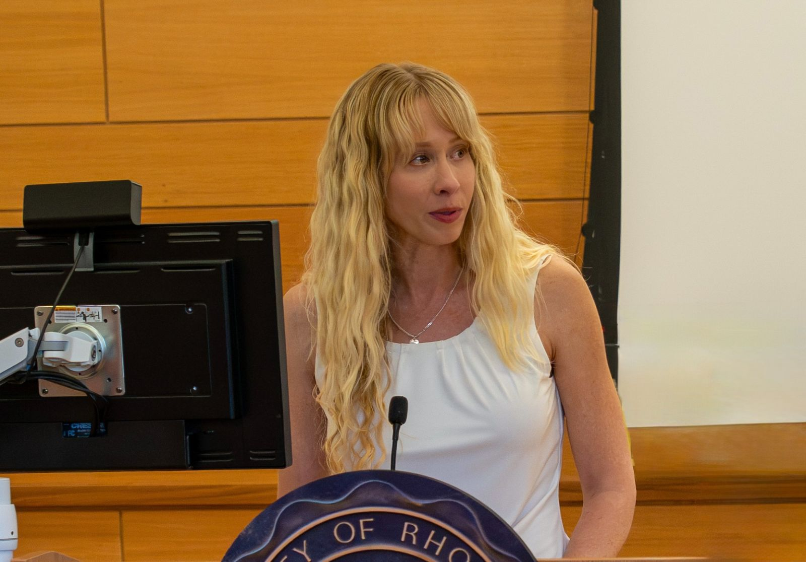
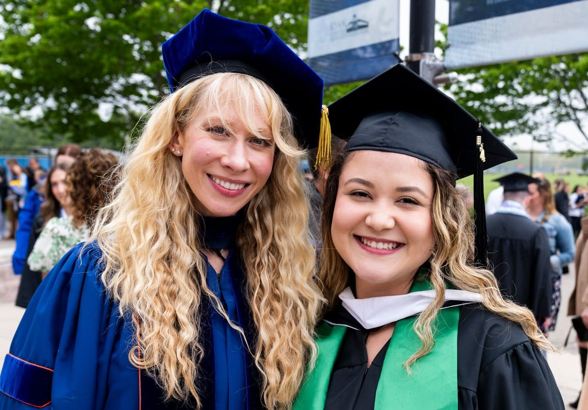

I teach courses on research methods, democratic politics, Latin American politics, and nuclear arms policy at the University of Rhode Island. I received the College of Arts and Sciences Tenure Track Teaching Excellence Award in 2023.

[List of courses I have taught](#courses)

## Public engagement and media

**Selected presentations, talks, and outreach**

- Lead survey writer, Rhode Island Survey Initiative, University of Rhode Island. 2025.
- "Democracy Between the Lines: Uneven Local Accountability in Latin America." Invited talk, World Affairs Council of Rhode Island. April 24, 2025.
- "Public Perceptions and Preferences on Housing." Presentation to HousingWorks RI. Fall 2025.
- Presentation on human rights in Mexico, Human Rights Day event. December 2024.
- Co-coordinator, Honors Colloquium, "[Democracy in Peril](https://www.uri.edu/news/2024/02/this-years-honors-colloquium-to-examine-democracy-in-peril/)," University of Rhode Island. 2024.

**Media**

- Interview on the Rhode Island Survey Initiative poll of the 2026 governor's race, quoted in Nancy Lavin, "[McKee and Foulkes are both in it to win it. URI poll finds voters unsure who to back](https://rhodeislandcurrent.com/2025/09/15/mckee-and-foulkes-are-both-in-it-to-win-it-uri-poll-finds-voters-unsure-who-to-back/)." *Rhode Island Current*. September 15, 2025.
- Interview on Rhode Island public opinion and the gubernatorial race, *The Dan Yorke Show*. September 16, 2025.
- Interview on [Brazil's democratic crisis](https://castro.fm/episode/JcXKOh), *Bartholomewtown* podcast. 2023.
- "[URI Professor Discusses Jan. 6-Style Unrest in Brazil](https://www.uri.edu/news/2023/01/uri-professor-discusses-jan-6-style-unrest-in-brazil/)." Expert Q&A, *Rhody Today*. 2023.

{fig-alt="Ashlea Rundlett lecturing to a full auditorium at the University of Rhode Island."}

::: {layout-ncol=2}
{fig-alt="Ashlea Rundlett speaking at a lectern."}

{fig-alt="Ashlea Rundlett in doctoral regalia standing next to a master's graduate in cap and gown at a University of Rhode Island commencement."}
:::

## Courses taught {#courses}

### University of Rhode Island

**Instructor**

- Challenge of Nuclear Arms (Summer 2024–2026)
- Scope and Methods, graduate (Spring 2026)
- Intro to Political Science Research (Fall 2018–2021, 2023, 2025; Spring 2020, 2021, 2025)
- Democracy in Peril (Fall 2024)
- Politics in Latin America (Fall 2017; Spring 2018, 2022, 2023, 2024)
- The Politics of Democratic Erosion (Spring 2024)
- R for Everyone (Spring 2023)
- Politics of the Shadow Economy, online (Fall 2022)
- Politics of Drug Trafficking, online (Summer 2019)
- Political Corruption (Spring 2018)

**Co-instructor**

- Racial Inequality in Government (Fall 2020, Spring 2021)

**Course development**

- R for Everyone (Spring 2022)

### University of Illinois Urbana-Champaign

**Instructor**

- Politics of Developing Countries, online (Summer 2016)
- Intro to American Politics, online (Summer 2015)

**Co-instructor**

- Research Design in Political Science (Fall 2016)

**Course development**

- Politics of Developing Countries, online (2015–2016 academic year)
